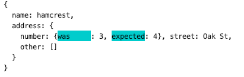

# mismatched

`mismatched` is a Typescript-based assertion and matcher framework, with a sophisticated compositional approach.
Available at https://github.com/rickmugridge/mismatched.

This can be used:
   - for `mismatched` assertions with [assertThat()](./ASSERTTHAT.md).
   - as matcher for arguments in mocked calls in [`thespian`](https://github.com/rickmugridge/)
   - for data validation with [validateThat()](./ValidateThat.md)

For latest changes, see [What is New](./WhatIsNew.md).

Also see: [FAQ](./FAQ.md), [assertThat()](./ASSERTTHAT.md), [validateThat()](./ValidateThat.md), 
[matchers](./MATCHERS.md), [PrettyPrinter](./PRETTYPRINTER.md), [Diff Tree](./DIFFTREE.md).

## Example Assertions

Here's a few simple examples of assertions (all these examples are in the `examples` directory here:

```
describe("Object-matching Examples", () => {
    const actual = {name: "hamcrest", address: {number: 3, street: "Oak St", other: [1, 2]}};

    it('Full object match', () => {
        assertThat(actual)
            .is({name: "hamcrest", address: {number: 3, street: "Oak St", other: [1, 2]}});
    });

    describe("Partial object match", () => {
        it('Do not care about one field', () => {
            assertThat(actual)
                .is({
                    name: "hamcrest",
                    address: {number: 3, street: "Oak St", other: match.any()}
                });
        });

        it('Matching optionally on several fields', () => {
            assertThat(actual)
                .is({
                    name: match.anyOf(["hamcrest", "tsDiffMatcher"]),
                    address: {
                        number: match.number.greater(0),
                        street: "Oak St",
                        other: match.ofType.array()
                    }
                });
        });
    });
});
```

We can see above that:
 - We can specify an object as the match, and a suitable matcher will be constructed automatically
 - We can use matchers at arbitrary points in the matching object (or array or at the top level)
   - Eg, because we don't care about some part of it (eg, a field which is randomly generated)
   - Eg, because we don't need to be too specific (some number, some array)
  
when matching fails, and the changes are minor, it provides feedback as a [diff tree](DIFFTREE.md) 
(looks to be related to a Haskell tree-diff). Eg:



When the `address.number` was 3 but was expected to be 4.

## Matchers

There are many built-in matchers. See [Matchers](./MATCHERS.md). 
This includes a section on writing custom matchers.

## Displaying the results of mismatches

We aim to provide useful output when a match fails. 
[PrettyPrinter](PRETTYPRINTER.md) does this.

The results are provided as a JS object, which shows what matched and what didn't in a [diff tree](DIFFTREE.md).
It does not display it in JSON format.
Instead, it is displayed as plain JS, so that it's easy to copy parts of it if a test is not right.

It aims to lay out the JS object/value to make it convenient to read.
It tries to strike a balance between all being on one line and being spread out over many lines.
Either extreme can make it difficult to read.

It allows for custom renderers.

## validateThat()

`validateThat()` is intended for validating data received.

Here's a simple example of validations (see the micro tests for individual matchers for other examples):

```
    it("validateThat():", () => {
            const validationResult = validateThat({f: 2, g: true})
                .satisfies({f: match.ofType.number(), g: match.ofType.boolean()});
            assertThat(validationResult.passed()).is(true);
    });
```

See [validateThat()](./ValidateThat.md) for further details.

## Automated tests for mismatched itself

There are many unit (micro) tests. To run:
```
  npm test
```

There are also property tests. To run:
```
   npm run prop-test
```
